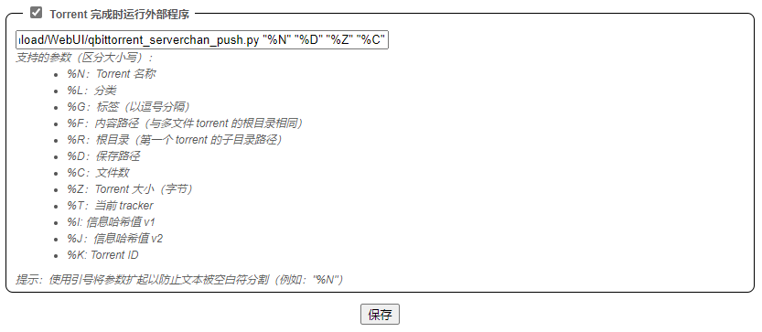

# qBittorrent_Serverchan_Push
qBittorrent_Serverchan_Push是一个基于**python3**编写的消息推送脚本，主要功能是在qBittorrent下载完成后调用**ServerChan**进行消息推送。  
  
**注意：** 本项目依赖的在线推送服务Server酱Turbo已开启会员订阅制度，免费账户可能无法正常使用该项目！

## 建议运行环境

群晖、威联通等NAS设备 **（需要开放ssh且允许root登陆）** ，或其他运行Linux发行版系统的无人值守下载设备。

## 兼容性测试

|  兼容性   | 系统  | 设备  |
|  ----  | ----  |----  |
| :white_check_mark:  | DSM 7.0 | 群晖DS119j |
| :white_check_mark:  | DSM 6.2.3 | 群晖DS918|

## 文件清单
|  文件   | 说明  |
|  ----  | ----  |
| qBittorrent_Serverchan_Push.ipynb  | Google Colab项目，用于在线编写、调试和提交 |
| qBittorrent_Serverchan_Push.py  | py脚本文件，用于qBittorrent调用 |

## 调用模块
|  模块   | 说明  |备注  |
|  ----  | ----  |----  |
| requests  | 用于向Server酱发起推送请求 | 需要额外安装 |
| sys  | 用于从qBittorrent获取外部参数 | Python3 标准库 |
| math  | 用于计算Torrent文件大小，并进行单位转换 | Python3 标准库 |  
| urllib  | 用于进行URL特殊字符编码 | Python3 标准库 |   
  

## 部署说明
### 申请Server酱API接口
1. 注册[Server酱Turbo](https://sct.ftqq.com/)账户，获取SendKey。
2. 在[消息通道](https://sct.ftqq.com/forward)中设置需要推送的途径，保存后进行发送测试，确认推送消息能够送达。
### 编辑脚本内容
1. 将**qBittorrent_Serverchan_Push.py**下载至运行qBittorrent设备的存储中。
2. 为运行qBittorrent的账户赋予执行权限，如：
```
sudo chmod 755 qBittorrent_Serverchan_Push.py
```
3. 编辑**qBittorrent_Serverchan_Push.py** ，在指定位置填入获取的SendKey并保存。
```
# 获取参数
torrent_name = sys.argv[1] #torrent名称
torrent_dir = sys.argv[2] #torrent存储位置
filesize_Byte = int(sys.argv[3]) #文件大小，单位Byte，类型int
file_num = sys.argv[4] #文件个数
key = "**********************************" #填入通过Serverchan获取的sendkey
```
### 安装依赖环境
配置Python3，根据[调用模块](https://github.com/Stalker-404/qBittorrent_Serverchan_Push#调用模块)安装缺失的模块，如：
```
pip3 install requests
```
#### 群晖设备额外注意：

1. 群晖系统需要在套件中心安装Python 3套件后，通过root用户登陆ssh安装pip3工具：
```
wget https://bootstrap.pypa.io/get-pip.py #下载pip3安装脚本
python3 get-pip.py #运行安装脚本

# 安装调用模块
pip3 install requests
```
2. 将**qBittorrent_Serverchan_Push.py**上传至群晖NAS后，需要在File Station中修改其权限，为qBittorrent应用程序提供**读取&写入**权限。
3. 由于没有其他品牌NAS设备，暂只提供群晖系统的额外说明。

## 使用说明

打开qBittorrent客户端或WebUI设置，勾选**Torrent 完成时运行外部程序**并在框内填入以下内容并保存：  
  
```python3 /<Your Path>/qbittorrent_serverchan_push.py "%N" "%D" "%Z" "%C"```  
  
其中： \<Your Path\>为qBittorrent_Serverchan_Push.py文件所在位置。  
  


## 微信服务号推送效果
 

## 开源协议
本项目使用[Apache License 2.0](https://github.com/Stalker-404/qBittorrent_Serverchan_Push/blob/main/LICENSE)开源许可证。
